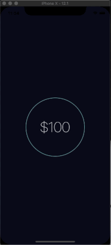

[]()
[](https://www.npmjs.com/package/rn-pulsing-circle)
[](https://www.npmjs.com/package/rn-pulsing-circle)

# rn-pulsing-circle

React Native component for creating an animated pulsing circle. Useful as an activity indicator. **Works on iOS & Android.**

## Example app



## Installation

1. Install the component:

`npm i --save rn-pulsing-circle`

## Usage

Import PulsingCircle:

```js
import { PulsingCircle } from 'rn-pulsing-circle'
```

Use as follows:

```jsx
<PulsingCircle />
```

You can also supply any of the following properties:

```jsx
<PulsingCircle
  delay={3000}
  mainBackgroundColor={'transparent'}
  mainCircleBorder={1}
  mainCircleColor={'#6cdbd2'}
  mainCircleSize={200}
  pulseCircleBorder={1}
  pulseCircleColor={'#6cdbd2'}
  pulseCircleSize={200}
  playAnimation={true}
  toggleOnPress={false}
/>
```

You can wrap children components to be displayed inside the circle:

```jsx
<PulsingCircle>
  <Text
    style={{
      color: 'white',
      fontSize: 48,
      fontWeight: '100',
      position: 'absolute'
    }}
  >
    $45
  </Text>
</PulsingCircle>
```

You can define an onPress to fire your method when the circle is pressed:

```jsx
handlePress = () => {
  alert('You pressed me')
}

render() {
  return (
    <PulsingCircle onPress={() => this.handlePress()} />
  )
}
```

Finally, you can manually trigger animation start, animation stop and toggle animation by adding a ref like so:

```jsx
<PulsingCircle ref="myCircle" onPress={() => this.handlePress()} />
```

```javascript
this.refs.myCircle.startAnimation() // Will force the animation to start
this.refs.myCircle.stopAnimation() // Will force the animation to stop
this.refs.myCircle.toggleAnimation() // if the animation is running, will stop the animation. Otherwise will start the animation
```

## Configuration

You can configure the component by passing the following props:

- **delay** - number of milliseconds to pause between animation cycles (default: 3000)
- **backgroundColor** - color of the background for the component. If unspecified, no background will be rendered
- **mainCircleBorder** - border thickness of the primary circle (default: 1)
- **mainCircleColor** - color of the primary circle (default: #6cdbd2)
- **mainCircleSize** - height/width of the primary circle (default: 200)
- **pulseCircleBorder** - border thickness of the pulsating circle (default: 1)
- **pulseCircleColor** - color of the pulsating circle (default: #6cdbd2)
- **pulseCircleSize** - height/width of the primary circle (default: 200)
- **playAnimation** - indicates whether the animation should be playing or not (default: true)
- **toggleOnPress** - indicates if the animation should toggle on/off when clicked (default: false)
- **onAnimationComplete** - you can pass a callback function that will be invoked when the animation cycle completes.
- **onPress** - you can pass a callback function that will be invoked when the component is pressed.
  )

## Author

Larry J Rutledge (larryjrutledge@gmail.com)

## License

MIT

## Special thanks

Special thanks to [Spencer Carli](http://www.handlebarlabs.com/) for helping me understand React Native Animations and getting me a long ways down the road to making this specific animation work correctly.
